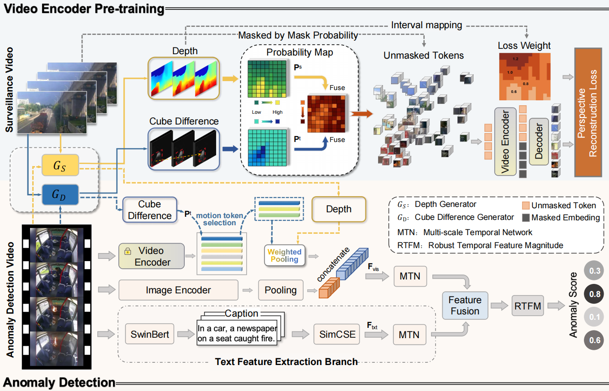
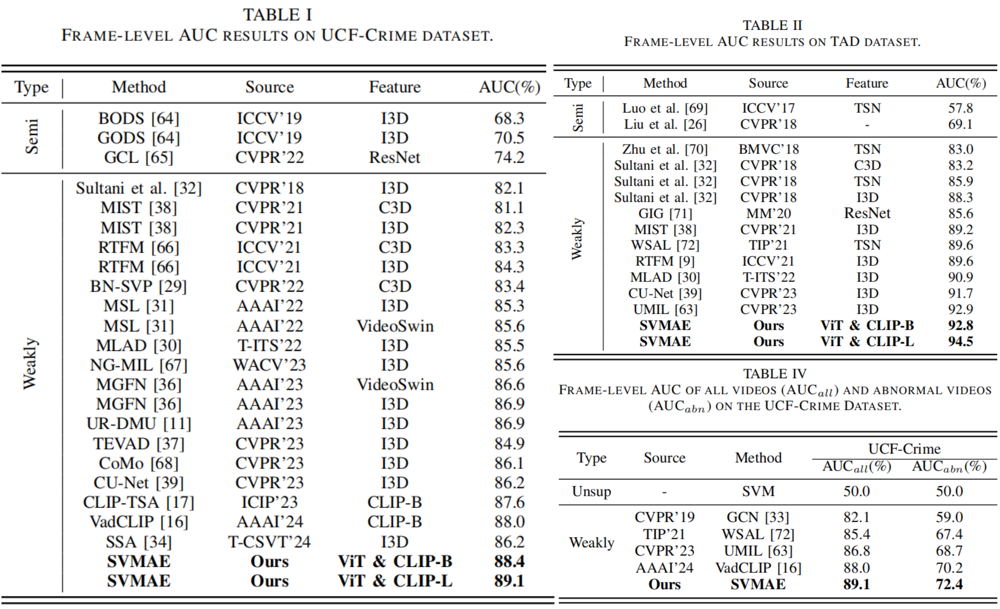
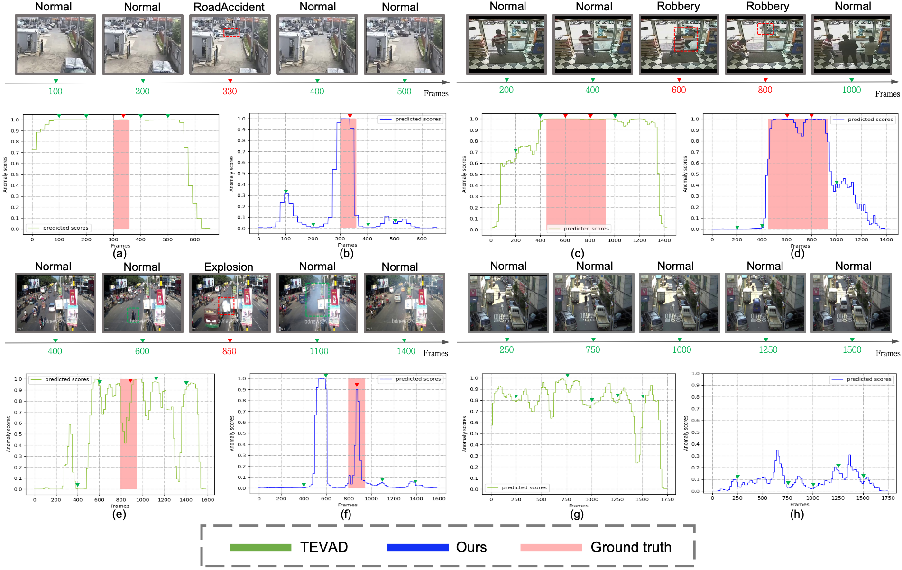

# FRD-UVAD

[//]: # ([![Open In Colab]&#40;https://colab.research.google.com/assets/colab-badge.svg&#41;]&#40;https://colab.research.google.com/drive/12Sh0j92YYmTa0oIuSEWWpPBCpIwCSVhz?usp=sharing&#41;)
[//]: # ([![HuggingFace Space]&#40;https://img.shields.io/badge/🤗-HuggingFace%20Space-cyan.svg&#41;]&#40;https://huggingface.co/spaces/Caoyunkang/Segment-Any-Anomaly&#41;)

This repository contains the official implementation of _Scene-aware Probabilistic Masking and Fusion for Video Anomaly Detection_.


## :fire:What's New
- _Scene-aware Probabilistic Masking and Fusion for Video Anomaly Detection_ is under peer review.


## :gem:Framework
[//]: # (We found that a simple assembly of foundation models suffers from severe language ambiguity. )
[//]: # (Therefore, we introduce hybrid prompts derived from domain expert knowledge and target image context to alleviate the language ambiguity. )

To enhance visual feature extraction, we propose the Surveillance Video Masked Autoencoder (SVMAE) framework. 
It uses scene-aware probabilistic masking and perspective reconstruction loss for efficient pre-training. 
Additionally, a dual encoder architecture with scene-aware token fusion is proposed for video anomaly detection.

The framework is depicted below:

[//]: # (![Framework]&#40;SSA_assets/framework.png&#41;)



## Quick Start

### Visual features and Caption Embedings.
1. You can download from [here](https://pan.quark.cn/s/85d261a1b699).
2. For UCF-Crime dataset, put the generated/downloaded features under `./save/Crime` folder. Other datasets follow the same structure.
3. For UCF-Crime dataset, change the path of visual features in `./list/ucf-videoMae-CLIP-L_UCF_9-5_9-1_finetune_dif_0.5_SP_norm_a0.05_fast.list` and `list/ucf-videoMae-test-CLIP-L_UCF_9-5_9-1_finetune_dif_0.5_SP_norm_a0.05_fast.list`. Other datasets follow the same structure.

### Install requirements
Run `pip install -r requirement.txt` to install the requirements.

### Run visdom
**!!!VERY IMPORTANT!!!**

Open a separate terminal and run `visdom` after installing the requirements before running the following commands.

### Training + Testing
Meanings of the arguments can be seen in `option.py`. To train the best model presented in the paper, use the following settings:

**UCF-Crime dataset**

Training
```bash
bash run.sh
```

Testing only 
```bash
bash run_test.sh
```
More are coming soon！

[//]: # ()
[//]: # (### :bank:Dataset Preparation)

[//]: # ()
[//]: # (We evaluate FRD-UVAD on four public datasets: Shanghaitech, CUHK Avenue and UCF-Crime.  )

[//]: # ()
[//]: # (Download ucf-crime train features from here:[https://pan.quark.cn/s/e978fc6a90c8], test features from C2FPL:[Concat_test_10.npy]&#40;https://mbzuaiac-my.sharepoint.com/personal/anas_al-lahham_mbzuai_ac_ae/_layouts/15/onedrive.aspx?id=%2Fpersonal%2Fanas%5Fal%2Dlahham%5Fmbzuai%5Fac%5Fae%2FDocuments%2FApplications%2FPaper%20Submissions%2FCVPR%202024%2Fconcatenated%5Ffeatures&ga=1&#41;**)

[//]: # ()
[//]: # ()
[//]: # (### :hammer:Environment Setup)

[//]: # ()
[//]: # (Run `conda env create -f environment.yaml` to install the requirements.)

[//]: # ()
[//]: # ()
[//]: # (### :page_facing_up:Repeat the public results)

[//]: # ()
[//]: # (**To train FRD-UVAD from scratch on UCF-Crime:**)

[//]: # ()
[//]: # (```)

[//]: # (python main.py --dataset_name ucfcrime --feature_pretrain_model i3d --feature_modal rgb --cross_clip 4 --lab False --lab_type wlab --beta 0.1 --delta 0.5 --Vitblock_num 8 --max_seqlen 320 --max_epoch 5 --Lambda 1_1_1)

[//]: # (```)

[//]: # ()
[//]: # ()
[//]: # (**To inference FRD-UVAD without auxiliary scorer,whose AUC is 77.56\%:**)

[//]: # ()
[//]: # (```python run_test.py --ckpt_path best_ckpt/best_ckpt_0.7756.pkl```)

[//]: # ()
[//]: # ()
[//]: # (**To inference FRD-UVAD with FRD-UVAD&#40;1 crop&#41; as auxiliary scorer,whose AUC is 80.72\%:**)

[//]: # ()
[//]: # (```python run_test.py --ckpt_path best_ckpt/best_ckpt_0.8072.pkl```)

[//]: # ()
[//]: # ()
[//]: # (**To inference FRD-UVAD with [C2FPL]&#40;https://github.com/AnasEmad11/C2FPL&#41; as auxiliary scorer,whose AUC is 82.12\%:**)

[//]: # ()
[//]: # (```python run_test.py --ckpt_path best_ckpt/best_ckpt_0.8212.pkl```)


## :dart:Performance




## 💘 Acknowledgements

[//]: # (Our work is largely inspired by the following projects. Thanks for their admiring contribution.)
[//]: # ()
[//]: # (- [C2FPL]&#40;https://github.com/AnasEmad11/c2fpl&#41;)

This code is based on 
[VideoMAE](https://github.com/MCG-NJU/VideoMAE),
[TEVAD](https://github.com/coranholmes/TEVAD) and 
[UR-DMU](https://github.com/henrryzh1/UR-DMU). 
We thank the authors for their great work.


<!-- 
## Citation

If you find this project helpful for your research, please consider citing the following BibTeX entry.


```BibTex
@ARTICLE{10539327,
  author={Tao, Chenchen and Wang, Chong and Lin, Sunqi and Cai, Suhang and Li, Di and Qian, Jiangbo},
  journal={IEEE Transactions on Multimedia}, 
  title={Feature Reconstruction with Disruption for Unsupervised Video Anomaly Detection}, 
  year={2024},
  volume={},
  number={},
  pages={1-14},
  keywords={Unsupervised video anomaly detection;transformer;cross attention;feature reconstruction},
  doi={10.1109/TMM.2024.3405716}}
``` 
-->
